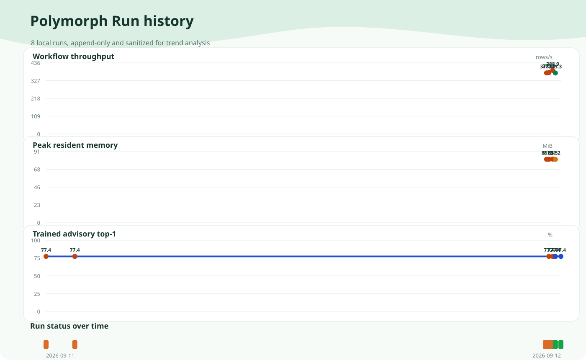

<p align="center">
  
</p>

<p align="center">
  <strong>Deutsch</strong> · <a href="README.md">English</a>
</p>

<p align="center">
  <strong>LOCAL-FIRST</strong> · <strong>FAIL-CLOSED AUTO</strong> · <strong>EXPLIZITE WRITE-OUTCOMES</strong><br>
  Sichere Importe und Integrationen, ohne die gefaehrlichen Randfaelle selbst neu zu bauen.<br>
  <a href="docs/TRUST_CENTER.md">Trust Center und Zwei-Minuten-Test mit eigenen Daten</a>
</p>

<h1 align="center">Polymorph</h1>

<p align="center">
  <strong>Daten zwischen inkompatiblen Systemen bewegen. Die Route beweisen, bevor geschrieben wird.<br>Plaintext bleibt an den Endpunkten. Wenn die Evidenz nicht reicht, wird sauber gestoppt.</strong>
</p>

<p align="center">
  <a href="docs/PERFORMANCE_BASELINE.md#file-inspection"></a>
  <a href="#gemessene-lokale-baseline"></a>
  <a href="#gemessene-lokale-baseline"></a>
  <a href="#optionale-modell-evidenz"></a>
</p>

<p align="center"><sub>Gemessene Baselines, keine universellen Versprechen. Ein Klick führt zum Kontext.</sub></p>
<p align="center"><sub>Open Source unter AGPL-3.0-only · alternative kommerzielle Lizenzierung verfügbar.</sub></p>

Polymorph ist eine local-first, policy-driven Data Bridge für wiederkehrende Imports und Integrationen, die zu wichtig für ein hoffnungsvolles Skript und zu speziell für eine riesige Integrationsplattform sind.

System A nennt ein Feld `customer_no`. System B erwartet `account_id`. Dann verschiebt jemand eine Spreadsheet-Spalte, benennt einen Header um, fügt eine Formel hinzu, ändert einen Foreign-Key-Vertrag oder schickt denselben Report mit anderem Layout.

Die traditionelle Lösung ist häufig eine Variante von: einmal mappen und hoffen, dass danach bitte niemand mehr irgendetwas anfasst.

Polymorph hat stattdessen Vertrauensprobleme.

Die zentrale Zuverlässigkeitsregel ist einfach:

**Unsicherheit muss Automation reduzieren, niemals Raten erhöhen.**

Ein Dateiname ist Evidenz. Ein erfolgreicher Parser-Aufruf ist Evidenz. Ein Model-Score ist Evidenz. Eine Recipe, die gestern funktioniert hat, ist Evidenz.

Gestern war übrigens auch ein anderer Tag.

Automatische Freigabe braucht unabhängig starke deterministische Evidenz, einen unveränderlichen validierten Plan und einen vollständigen No-write-Preflight. Kann Polymorph eine Route innerhalb des erklärten Betriebsbereichs nicht beweisen, verlangt es Review, statt Selbstbewusstsein zu erfinden.

Stabile Protocol- und Persistenz-Namespaces sind absichtlich vom Produktnamen getrennt. Ein späteres Rebranding darf verschlüsselte Envelopes, Delivery-State oder Recipe-Historie nicht ungültig machen. Branding darf eine Midlife-Crisis haben. Persistierter kryptografischer Zustand eher nicht.

## Hier anfangen

| Ich moechte... | Einstieg | Was passiert |
| --- | --- | --- |
| **Polymorph lokal ausprobieren** | `python scripts/dev.py demo --locale de --open` | Erstellt eine eigenstaendige synthetische HTML-Demo. Kein Account, Netzwerk, Modell oder Ziel-Write. |
| **Polymorph einbetten** | [`docs/PRODUCT_API.md`](docs/PRODUCT_API.md) | Explizite `move(...).prepare()`- und `execute()`-API, Produkt-Events und strukturierte Outcomes. |
| **Das Security-Modell bewerten** | [`SECURITY.md`](SECURITY.md) | Trust Boundaries, ehrliche Grenzen, Failure-Semantik und Hardening-Status vor einem Einsatz pruefen. |

Connector-Autoren beginnen bei [`docs/CONNECTORS.md`](docs/CONNECTORS.md). Installierter
Third-Party-Connector-Code wird nur nach einem expliziten Opt-in gesucht und importiert.

## Warum Polymorph existiert

Noch ein AI-Column-Mapper ist kein besonders interessantes Produkt. Das ist eine Funktion, und mehrere Anbieter haben sie bereits.

Polymorph soll die Vertrauensschicht zwischen Systemen sein, die nie dafür gebaut wurden, sich gegenseitig zu verstehen.

Die nützliche Version macht vier Dinge gut:

1. **Die Quelle konservativ verstehen.** Bytes, Struktur, Schema, Beziehungen und Policy prüfen, bevor Labels geglaubt werden.
2. **Die Route vor dem Schreiben beweisen.** Mapping, Transformationen und Foreign-Key-Auflösung werden gegen genau einen Plan validiert.
3. **Plaintext an den Endpunkten halten.** Das Relay bekommt Ciphertext und Routing-Metadaten, nicht die Payload-Werte, die es transportiert.
4. **Langweilig scheitern.** Mehrdeutige Mappings brauchen Review. Unbekannte Write-Outcomes bleiben unbekannt. Ein Retry ist kein Optimismus mit Schleife drumherum.

Die ersten Nutzer sind Entwickler und technische Operatoren mit wiederkehrenden Imports, bei denen ein falscher Identifier, Betrag, Credential oder Foreign Key teuer wird:

- Agenturen, die Kundenexports in unterschiedliche Kundensysteme bewegen
- kleine Operations-Teams, die Excel-, CSV- oder API-Daten in ERP oder Datenbank importieren
- sicherheitsbewusste Teams, die Payloads nicht an einen gehosteten Mapping-Service schicken können
- Softwareanbieter, die eine self-hosted Ingestion-Kante für Kundendaten brauchen
- regulierte Teams, die einen prüfbaren Plan und ehrliche Zustände für unsichere Writes brauchen

## Evidenz ist keine Autorität

Polymorph trennt bewusst hilfreiche Signale von Signalen, die Automation autorisieren dürfen.

| Signal | Hilfreich? | Darf allein einen Write autorisieren? |
| --- | --- | --- |
| Dateiendung oder Anzeigename | Ja | Nein |
| Erfolgreicher Parser-Aufruf | Ja | Nein |
| Magika-Klassifikation | Ja | Nein |
| Alte Recipe | Ja | Nein |
| Embedding-Ähnlichkeit | Ja | Nein |
| Cross-Encoder-Score | Ja | Nein |
| Aktuelles Schema, Policy und deterministische Contract-Evidenz | Ja | Ja, wenn alle Gates bestehen |

**Hilfreich ist nicht autorisiert.**

Ein Modell darf Kandidaten besser sortieren. Einen Stift bekommt es trotzdem nicht.

Wenn ein hochkonfidentes Modellresultat einem unabhängig stärksten deterministischen Ziel widerspricht, wird das Mapping review-required. Eine größere Zahl hinter dem Komma ist keine neue Trust Boundary.

## Was v0.4 alpha bereits macht

### Input Trust

- Content-first-Dateiinspektion. Parserauswahl vertraut weder Dateiendung noch Anzeigename.
- Opened-handle Identity Binding für CSV, JSON und Excel schließt gewöhnliche Path-Swap-Lücken zwischen Inspektion und Parsing.
- ZIP- und OOXML-Central-Directory-Prüfungen blockieren Traversal, Symlinks, doppelte oder verschlüsselte Member, verdächtige Expansion, übergroße Member, Makros sowie externe Workbook-Links und Datenverbindungen, bevor ein Workbook-Parser geöffnet wird.
- GZIP-Member werden bounded gestreamt und mit Member-Limits validiert.
- JSON und XML haben explizite Budgets für Parse-Größe, Tiefe, Items, Elemente und Attribute je Tag, bevor teurere Verarbeitung beginnt.
- Optionale lokale Magika-Evidenz kann die deterministische Erkennung challengen. Ein starker Konflikt blockiert automatische Parserauswahl, statt einen Confidence-Beliebtheitswettbewerb zu starten.
- Eine fail-closed Parser-Worker-Basis kann einen Exact-byte-Snapshot pruefen. Unter Linux ist nicht-setid Bubblewrap 0.12.0 oder neuer das strikte Backend. Unter Windows tritt der Worker fuer CPU-, Speicher- und Prozessbaum-Containment einem Job Object bei. Das ist Resource Containment, kein Filesystem- oder Network-Sandboxing.
- Excel-Parsing verlangt XML-Härtung über `defusedxml` und erkennt danach unter anderem Title Rows, verschobene Spalten, wiederholte Header und Fixed-width-Identifier wie `000042`.
- Spreadsheet-Formeln werden separat erkannt. Cached Formula Results haben keine bewiesene Frische und blockieren daher automatische Recipe-Promotion.
- CSV-Dialekte werden über ein deterministisches Candidate-Ensemble gewählt und können CleverCSV einbeziehen. Ein knappes Unentschieden wird abgelehnt statt geraten. Revolutionär, offenbar.

### Mapping und Preflight

- Deterministisches Schema-Matching ist die automatische Autorität.
- Matching nutzt Namen, Aliases, deklarierte Typen, Nullability, Sensitivity, Field Roles und verifizierte Relationship-Evidenz.
- Optionale lokale Embeddings und ein multilingualer Cross-Encoder-Reranker dürfen die Candidate-Reihenfolge verbessern, aber kein Mapping allein autorisieren.
- Target-Kollisionen, gerichtete Typ-Probleme, Sensitivity-Konflikte und schwache Relationship-Beweise reduzieren oder blockieren Automation auch dann, wenn ein Score hübsch aussieht.
- Versionierte Recipes speichern wiederverwendbares Gedächtnis, keine Erlaubnis. Jede Wiederverwendung wird an aktuelle exakte Schemas gebunden, bekommt einen neuen Plan-Digest, wird erneut validiert und muss erneut durch Preflight.
- Wiederholt abgelehnte Recipe-Runs reduzieren Vertrauen und suspendieren automatische Wiederverwendung, statt den Matcher kreativer werden zu lassen.
- `prepare` kombiniert Content Inspection, Mapping, Recipe-Reuse und vollständigen No-write-Preflight.
- Full-scan-Preflight übt Source-Transforms und optionale read-only Foreign-Key-Auflösung aus, ohne Destination-Writes auszuführen.
- Sampled Scans sind Diagnose. Sie dürfen keine Recipe automatisch promoten.
- `--max-input-records` ist ein hartes Blast-Radius-Budget pro Run. Der erste Record über dem Limit blockiert Readiness, statt eine Quelle stillschweigend freizugeben, die über Mittag zwei Größenordnungen gewachsen ist.

### Blinder Transport und Delivery

- Full-record Blind Transport nutzt X25519, HKDF-SHA256 und ChaCha20-Poly1305.
- Source-Records werden mit Ed25519-Identitäten authentifiziert, die an Tenant und Connector gebunden sind, inklusive begrenztem Rotation-Drain und Hard Revocation.
- Destination Recipient Keys stammen aus separat gepinnten Ed25519-Destination-Identitäten und nicht allein aus Control-Plane-Behauptungen.
- Signierte route-bound Recipient Certificates bilden eine monotone Rotation Chain. Ein optionaler lokaler Checkpoint weist veraltete Generationen und konkurrierende Forks zurück.
- Eine durable Source Outbox persistiert exakt den signierten Ciphertext des ersten Sends. Ack verloren? Exakt diese Bytes erneut senden. Denselben logischen Record neu zu versiegeln erzeugt anderen authentifizierten Ciphertext, weil Kryptografie nicht verpflichtet ist, eine bequeme Retry-Implementierung zu unterstützen.
- Das Relay speichert Ciphertext plus erforderliche Routing-Metadaten, nutzt fenced Leases und ein persistentes Idempotency-Ledger.
- Destination Delivery unterscheidet bewiesenes `NOT_COMMITTED` von `UNKNOWN`. Unbekannt wird nicht retry-safe, nur weil eine Exception sich entschuldigend angehört hat.
- Capability-gated Atomic Batches behalten per-Record Authentication, Ledger-, Audit- und Replay-Evidenz und nutzen für unterstützte SQLite- und PostgreSQL-Writes eine Transaktion.
- Jeder Batch ist nach Record-Anzahl und Sealed-wire-Größe begrenzt.
- Der Destination Runtime ist an genau einen Plan und Target Contract gepinnt und prüft Field Set, Required Values, Nullability und Typen erneut, bevor der Connector-Write beginnt.
- CSV-Exports blockieren spreadsheet-formula-artige Werte standardmäßig.
- HTTP-Redirects zählen niemals als committed Write.

### Betrieb und Diagnose

- Ed25519-signierte Capabilities begrenzen privilegierte Operationen.
- Metadata-only Audit Events bilden eine SHA-256-Hash-Chain und können zusätzlich signiert werden.
- Reason Codes erklären, warum etwas blockiert oder herabgestuft wurde.
- Recipe-Health-Zusammenfassungen machen wiederholte Ablehnung sichtbar.
- Payload-freie Operational Events tragen Run- und Correlation-IDs für den aktuell instrumentierten Workflow.
- Credential References und verschlüsselte Destination-Recipient-Key-Dateien vermeiden die kreative Annahme, rohe Connection Strings seien bereits Secret Management.

## Trust Model

```text
              schema + policy + exact plan
                         |
                         v
                 +---------------+
                 | control plane |
                 +---------------+
                         |
                    plan digest
                         |
      source trust      |                 destination trust
         boundary       |                    boundary
            |           |                       |
            v           |                       v
     +--------------+   |              +------------------+
     | source agent |   |              | destination agent|
     +--------------+   |              +------------------+
       | plaintext       |                    ^ plaintext
       | local transforms|                    | FK lookup
       v                 |                    |
    seal to destination public key            |
       |                                      |
       v                                      |
    +--------------------------------------------------+
    |        ciphertext-only relay / data plane        |
    | route metadata, leases, digests, no private key  |
    +--------------------------------------------------+
```

Das Relay sieht weiterhin die Metadaten, die es zum Routen eines Records braucht, darunter Tenant, Connector-IDs, Record- und Transfer-IDs, Plan-Digest und Field-IDs. Payload-Vertraulichkeit ist keine Traffic-Analysis-Resistenz. Source und Destination sehen Plaintext notwendigerweise an ihren jeweiligen Trust Boundaries.

Der öffentliche Destination-Identity-Key muss die Source über einen operator-kontrollierten Kanal erreichen, der unabhängig von der Control Plane ist. Die Control Plane darf signierte Recipient-Key-Certificates verteilen, kann aber deren Tenant-, Destination-, Key-, Validity- oder Rotation-Metadaten nicht ersetzen.

Siehe [Authentizität und Rotation von Recipient Keys](docs/RECIPIENT_KEY_ROTATION.md).

## Schnellstart

Python 3.11 bis 3.14 wird in CI ausgeführt.

Repository klonen oder auf GitHub **Code > Download ZIP** wählen und entpacken. Polymorph nutzt
weder Git-Submodule noch Git-LFS-Assets. Der kürzeste modellfreie lokale Start ist für beide Wege
gleich:

```bash
git clone https://github.com/IamAngusU/polymorph.git
cd polymorph
python scripts/bootstrap.py --skip-checks
python scripts/dev.py doctor
python scripts/dev.py connectors
python scripts/dev.py demo --locale de --open
python examples.py
```

Beim ZIP zuerst mit `cd` in den entpackten Ordner `polymorph-main` wechseln und die letzten drei
Befehle ausführen. Bootstrap erstellt `.venv`, installiert den lokalen Checkout und endet mit
`doctor`; die virtuelle Umgebung muss nicht manuell aktiviert werden. Für die vollständige
Development-Test-Suite `python scripts/bootstrap.py` ohne `--skip-checks` ausführen.

Optionale Research-Modelle werden für den Core nicht benötigt:

```bash
python scripts/bootstrap.py --skip-models
```

`python examples.py` startet ein kleines deterministisches Mapping-Beispiel ohne Modelle oder externe Services.

Siehe [Development setup](docs/DEVELOPMENT.md) für das absichtlich lokale Datenlayout.

## In eine Anwendung einbetten

Die Convenience-API bleibt absichtlich zweiphasig. Eine Session anzulegen und vorzubereiten schreibt
niemals:

```python
from polymorph import ConnectorSpec, move

run = move(
    source="./incoming/customers.csv",
    destination=ConnectorSpec.destination(
        "database",
        url="sqlite:///application.sqlite",
        table="customers",
    ),
    max_input_records=10_000,
)
run.on("review_required", review_ui.open)
run.on("progress", progress_view.update)

prepared = run.prepare()
if prepared.ready:
    outcome = run.execute()
```

`execute()` ist ein lokaler Same-Process-Convenience-Pfad und nicht das ciphertext-only Relay. Er
verlangt aktuell eine content-gepruefte unveraenderliche Datei-Source und verweigert Secret- oder
Opaque-Forwarding. Database-, HTTP- und Custom-Sources koennen weiterhin inspiziert und vorbereitet
werden; wenn Snapshot-Identitaet oder getrennte Endpunkte wichtig sind, ist der separat autorisierte
Secure-Agent-Workflow richtig. Destinations sind immer explizit. Polymorph errät niemals eine
Datenbanktabelle oder Remote-Ressource aus einer URL.

Siehe [Embedding und Produkt-Events](docs/PRODUCT_API.md) fuer Review-Handling, Event-Lokalisierung
und alle strukturierten Outcomes.

## Der einfachste sichere Workflow

Zielschema inspizieren, dann `prepare` die Source inspizieren, eine Recipe finden oder einen Mapping-Plan bauen lassen und den vollständigen No-write-Preflight ausführen:

```bash
polymorph inspect db 'sqlite:///target.sqlite' --table orders -o target.schema.json
polymorph prepare ./incoming-file target.schema.json --output-plan orders.plan.json --remember \
  --max-input-records 5000
```

Ein Plan wird nur geschrieben, wenn die Route promotable ist.

Reicht die Evidenz nicht, beendet sich `prepare` als review-required, statt ein selbstbewusst aussehendes JSON zu erzeugen und Future-you herausfinden zu lassen, was es eigentlich meinte.

Für eine Foreign-Key-Route kommt ein read-only Destination Resolver dazu, damit der Preflight den Natural-Key-Lookup vor Promotion beweisen kann:

```bash
polymorph prepare ./orders-upload target.schema.json \
  --resolver-db-url 'sqlite:///target.sqlite' \
  --resolver-db-table orders
```

## Manueller Plan-Workflow

Wenn jede Stufe einzeln gebraucht wird:

```bash
polymorph inspect auto ./upload.bin -o source.schema.json
polymorph map source.schema.json target.schema.json
polymorph plan create source.schema.json target.schema.json -o route.plan.json
polymorph plan validate route.plan.json source.schema.json target.schema.json
polymorph preflight ./upload.bin target.schema.json route.plan.json
```

Review-Level-Entscheidungen werden standardmäßig nicht in einen Plan geschrieben. `--allow-review` ist für eine explizite Operator-Entscheidung da, nicht um den Matcher höflich zu bitten, endlich weniger schwierig zu sein.

## Optionale Modell-Evidenz

Der Core funktioniert vollständig ohne Modell.

Der optionale CPU-Descriptor-Encoder läuft zur Runtime lokal, ist auf eine Upstream-Revision gepinnt und wird bei Installation hash-verifiziert. Der native SentencePiece-Tokenizer vermeidet das Laden der deutlich größeren JSON-Vokabular-Repräsentation.

```bash
pip install -e ".[semantic]"
polymorph model install --profile multilingual-cpu
polymorph prepare ./incoming-file target.schema.json --models
```

Beide aktuellen Model-Profile sind für Product Use research-only. Provenance und Dataset Terms stehen unter [Model profiles](docs/MODEL_PROFILE.md). Der Standard-Bootstrap lädt keines davon herunter.

Modelle bekommen Schema-Deskriptoren, keine Record-Payload-Werte. Ihre Evidenz darf Ordering verbessern und Review-Arbeit reduzieren. Automatische Promotion braucht weiterhin unabhängig starke deterministische Evidenz.

Auf dem eingecheckten synthetischen Regression-Corpus treffen die Modellpfade aktuell dieselben automatischen Entscheidungen wie das deterministische Profil.

| Profil | Ergebnis | Wall Time | Peak RSS |
| --- | --- | ---: | ---: |
| Deterministisch | Gleiche Entscheidungen | 4,02 ms | 73,30 MiB |
| Encoder | Gleiche Entscheidungen | 0,926 s | 284,52 MiB |
| Encoder + Reranker | Gleiche Entscheidungen | 2,325 s | 437,87 MiB |

Der Encoder-Run erreichte 100% beobachtete automatische Precision bei 17 von 17 automatischen Entscheidungen und 89,47% Automation Coverage unter explizit eligible Fields. Das ist Regression-Evidenz auf einem synthetischen Corpus, keine Behauptung universeller Mapping-Genauigkeit.

Ja, der Modell-Stack funktioniert also.

Auf diesem Corpus wandelt er aktuell vor allem mehr Strom in Wärme um, ohne das Decision Set zu verbessern. Wir messen weiter, statt Lüftergeräuschen architektonische Bedeutung zu verleihen.

Siehe [Gemessene Performance-Baseline](docs/PERFORMANCE_BASELINE.md).

## Diagnose und Benchmarks

```bash
pip install -e ".[fileid,csv-detection,benchmark]"
polymorph inspect auto ./unknown-upload --magika

# Strikte Linux-Grenze. Fail-closed, wenn kompatibles Bubblewrap fehlt.
polymorph inspect isolated-content ./unknown-upload

polymorph doctor
polymorph benchmark inspect ./unknown-upload --records 10000 --magika
polymorph benchmark parser-worker ./unknown-upload --runs 5
polymorph benchmark mapping ./benchmarks/safety-regression.json \
  --require-auto-precision 1.0 \
  --require-automation-coverage 0.70
polymorph benchmark workflow --records 1000 --batch-size 100 \
  --work-dir ./workflow-run --output workflow.json
polymorph recipe health
polymorph audit summary ./audit.sqlite
polymorph events check ./workflow-run/operational-events.jsonl --run-id RUN_ID
polymorph explain write_outcome_unknown
```

`RUN_ID` ist der Wert von `workflow.observability.run_id` aus `workflow.json`.

Die Benchmark-Kommandos sind explizite Diagnostik. Normale Production-Pfade schalten nicht CPython Allocation Tracing oder RSS Polling ein, nur damit sich ein Graph beteiligt fühlt.

## Gemessene lokale Baseline

Am 12.09.2026 bewegten fünf Runs mit jeweils frischem Workflow-State über den vollständig
durablen, signierten und auditierten lokalen Transport 1.000 Records mit fünf String-Feldern bei
**367,99 bis 376,81 Records/s**, Median **375,83 Records/s**, zu einer SQLite-Destination mit
100er-Batches. Die mediane gemessene Laufzeit betrug **2,661 s**, der mediane gesampelte Peak RSS
**81,33 MiB** auf Windows Build 26200, Python 3.11.9 und einem Intel Core i9-12900K.

Jeder Run enthielt Recipient-Certificate-Verifikation, X25519- und ChaCha20-Poly1305-Sealing, Ed25519-Source-Signaturen, durable Source Outbox, Relay-Validation und fenced Leases, Destination Authentication und Decryption, Contract Validation, SQLite-Writes, Sealed-spool-Cleanup, signiertes Hash-chain-Audit und Acknowledgements.

In jedem aufbewahrten Run wurden alle 1.000 Records genau einmal zugestellt. Alle fünf Messwerte
und die Methodik liegen unter
[`benchmarks/results/workflow-windows-20260912.json`](benchmarks/results/workflow-windows-20260912.json).

Der deterministische Workflow-Benchmark lädt keine optionalen Mapping-Modelle. Eine separate
`nvidia-smi`-Messung im 500-ms-Takt beobachtete über zwei dieser Runs auf einer RTX 3080 mit
10.240 MiB Gesamt-VRAM konstant 2.788 MiB, also **0 MiB beobachtete Änderung**. Die gemessene
GPU-Auslastung galt für das ganze Gerät und ist keinem Prozess zugeordnet.

Siehe [Performance baseline](docs/PERFORMANCE_BASELINE.md) für Maschine, Methodik und Einschränkungen.

## Ecosystem- und Operations-Kit (neu in 0.4.0a5)

Das neue lokale Toolkit schliesst praktische Integrationsluecken, ohne Evidenz zu Autoritaet zu
machen:

```powershell
polymorph-kit connector scaffold "Acme CRM" --output .\acme-connector
polymorph-kit quality inspect .\incoming.csv --output .\quality.json
polymorph-kit ui export .\review-ui
polymorph-kit review finalize .\review-draft.json --output .\review.json
polymorph-kit sync inspect .\.polymorph\sync.sqlite3
```

Die Review-Komponente ist dependency-frei, hell, responsiv, zweisprachig und framework-neutral.
Ihre Entwuerfe enthalten Schema-Metadaten, aber keine Rows, und verleihen keine Write-Autoritaet.
Cleaning-Plans sind explizit und lazy. OAuth-Access-Tokens bleiben im Speicher. Wiederkehrende
Cursor ruecken nur nach einem strukturiert abgeschlossenen Write vor. Details stehen im
[Ecosystem-Kit](docs/ECOSYSTEM_KIT.md), in der [Review-UI-Anleitung](docs/REVIEW_UI.md), bei den
[wiederkehrenden Runs](docs/RECURRING_RUNS.md) und in den
[Enterprise-Readiness-Fakten](docs/ENTERPRISE_READINESS.md).

## Dokumentation

- [Architektur](docs/ARCHITECTURE.md)
- [Reliability Model](docs/RELIABILITY.md)
- [Product Direction](docs/PRODUCT.md)
- [File Trust Gate](docs/FILE_TRUST.md)
- [Parser Isolation](docs/PARSER_ISOLATION.md)
- [Recipes](docs/RECIPES.md)
- [Benchmarking](docs/BENCHMARKING.md)
- [Workflow und Failure Lab](docs/WORKFLOW_LAB.md)
- [Gemessene Performance-Baseline](docs/PERFORMANCE_BASELINE.md)
- [Protocol](docs/PROTOCOL.md)
- [Threat Model](docs/THREAT_MODEL.md)
- [Operations und Replay Safety](docs/OPERATIONS.md)
- [Operational Visibility](docs/OBSERVABILITY.md)
- [Recipient-Key-Authentizität und Rotation](docs/RECIPIENT_KEY_ROTATION.md)
- [Security Coverage](docs/SECURITY_COVERAGE.md)
- [Ecosystem und Dataset Review](docs/ECOSYSTEM_REVIEW.md)
- [Operator Workflows](docs/WORKFLOWS.md)
- [Test Strategy](docs/TEST_STRATEGY.md)
- [Roadmap](docs/ROADMAP.md)
- [Security melden](SECURITY.de.md)
- [Beitragen](CONTRIBUTING.de.md)
- [Lizenzierung erklärt](LICENSING.de.md)
- [Name und Logo](TRADEMARKS.de.md)

## Status: Alpha heißt Alpha

Polymorph bleibt Alpha.

Inspection, Mapping, Planning und Preflight sind über die CLI verfügbar. Source Transport, Relay und Destination Delivery sind getestete Python-APIs. Long-running Agent Services, ein authentifizierter Control Channel und ein Deployment Supervisor sind weiterhin Roadmap-Arbeit.

Wichtige aktuelle Grenzen:

- Strikte Linux-Containment deckt derzeit nur den Content-Inspection-Worker ab.
- Strukturierte Schema-Parser und Record-Iteration laufen nach akzeptiertem Content Gate weiterhin im lokalen Polymorph-Prozess.
- Windows-Worker nutzen Job-Object-Resource-Containment fuer CPU-, Speicher- und Prozessbaum-Limits. Filesystem- oder Network-Sandboxing bieten sie weiterhin nicht.
- Durable Trust-Bundle-Distribution existiert noch nicht.
- Es gibt noch kein kumulatives per-Tenant Relay-Queue-Quota.
- Es gibt noch keinen externen Audit-Checkpoint gegen Log-Suffix-Truncation.
- Rohe Database-URLs können Credentials über Shell History leaken. Production-Automation sollte `DatabaseEndpoint` plus Secret Provider nutzen.
- Automatic-Promotion-Policy braucht weiterhin einen großen source-separated adversarial Corpus und unabhängige Security Review.
- Operational-Event-Coverage außerhalb des aktuell instrumentierten Workflows ist unvollständig.
- Destination Audit bleibt optional.
- Notification Service und Queue Metric Exporter existieren noch nicht.

Diese Grenzen stehen hier, weil „Alpha“ ein Software-Reifegrad ist und kein Deko-Badge, das verschwindet, sobald die README teuer aussieht.

## Lizenz

Polymorph ist Open Source unter der **GNU Affero General Public License Version 3 only** (`AGPL-3.0-only`).

Kommerzielle Nutzung ist unter AGPL erlaubt. Wenn diese Bedingungen für den Use Case passen, ist keine separate bezahlte Lizenz nötig. Für proprietäre oder Closed-source-Nutzung und andere Use Cases mit abweichenden Anforderungen gibt es eine separate kommerzielle Lizenz.

**Open Source heißt nicht autorenlos.** Copyright- und Lizenzhinweise bleiben Bestandteil des Projekts, und modifizierte Versionen müssen die Notice- und Source-Pflichten der AGPL erfüllen.

Siehe [LICENSING.de.md](LICENSING.de.md) für die menschlich lesbare Einordnung, [COMMERCIAL.de.md](COMMERCIAL.de.md) für alternative kommerzielle Lizenzierung und [TRADEMARKS.de.md](TRADEMARKS.de.md) für die Polymorph Name-und-Logo-Regeln.

Copyright 2026 Angus Uelsmann · [angusu.de](https://angusu.de) · [NOTICE](NOTICE)

Third-party-Komponenten behalten ihre jeweiligen Lizenzen; siehe [THIRD_PARTY.md](THIRD_PARTY.md).

## Lokaler Abnahmesnapshot (12.09.2026)

Auf einem Intel Core i9-12900K mit Windows und Python 3.11 hat der finale vollstaendige Polymorph-Run-Test drei integritaetsgepruefte Workflow-Samples mit je 1.000 Rows gemessen: 357,75-373,56 Rows/s (Median 373,29), 2,677-2,795 s Laufzeit (Median 2,679) und 80,88-81,23 MiB Peak-RSS. Die eigene Fuenf-Lauf-Baseline bleibt mit 367,99-376,81 Rows/s (Median 375,83) die weniger verrauschte Hauptmessung; Rohdaten und Grenzen stehen in `benchmarks/results/workflow-windows-20260912.json`.

Der `0.4.0a3`-Streaming-CSV-Rewrite kopierte 500.000 vorhandene Rows und haengte 500.000 generierte Rows in eine 23.277.791-Byte-Datei an. Gemessen wurden 2,704 s, 184.939 angehaengte Rows/s und 9.613.312 Byte RSS-Anstieg ueber der Baseline von 38.072.320 Byte. Das ist ein einzelner lokaler Windows-Lauf, keine plattformuebergreifende Speichergarantie.

In zwei GPU-Samples nach den Fixes blieb der geraeteweit belegte VRAM exakt bei 2.788 MiB, also 0 MiB beobachtete Aenderung. Die Messung ist nicht prozessbezogen und beweist nicht, dass andere Anwendungen keine GPU nutzten. Der advisory Ranking-Vergleich auf der festen Validation verbesserte sich von 47/84 untrainiert auf 61/84 trainiert, mit 14 paarweisen Verbesserungen, 0 Regressionen, 0 unsicheren Auto-Entscheidungen und unveraenderter deterministischer Autoritaet. Das ist synthetische Validation, kein unabhaengiger Produktions-Holdout.

## Downloads

- [Aktuellen Quellcode direkt als ZIP laden](https://github.com/IamAngusU/polymorph/archive/refs/heads/main.zip)
- [Geprueftes v0.4.0a8-Pre-Release mit Wheel, sdist und Polymorph Run 1.1.0 Buddy laden](https://github.com/IamAngusU/polymorph/releases/tag/v0.4.0a8)

## Langfristige Run-Metriken



Jeder unterstuetzte Buddy-Lauf aktualisiert die append-only lokale Historie unter `.polymorph/metrics`. Das getrackte SVG und JSONL werden erst nach ausdruecklicher Pruefung mit `python scripts/run_metrics.py --project "D:\polymorph" --export-public` aktualisiert; der Befehl committet und pusht nie selbst. Siehe [Vertrag der Metrik-Historie](docs/METRICS_HISTORY.md).

## In fuenf Minuten starten

Neue Nutzer beginnen mit [`START-HERE.de.md`](START-HERE.de.md). Unter Windows:

```powershell
git clone https://github.com/IamAngusU/polymorph.git
cd polymorph
py -3.11 -m venv .venv
.venv\Scripts\python -m pip install ".[benchmark]"
World-Benchmark.cmd
```

Der Nachweis laedt keine Daten hoch, aktiviert kein Modell, pusht nichts und startet keine GitHub
Action. Parquet, PostgreSQL und die datensparsame Review-Zeitmessung stehen in der Startanleitung.
